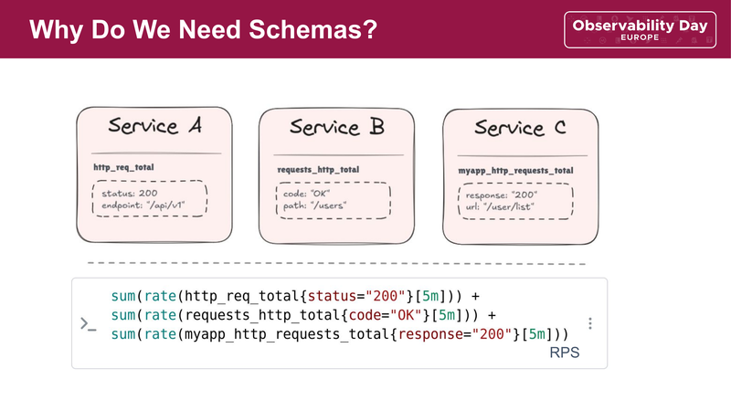
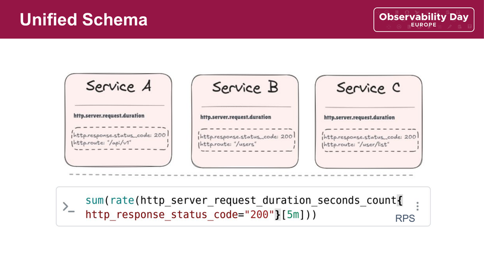
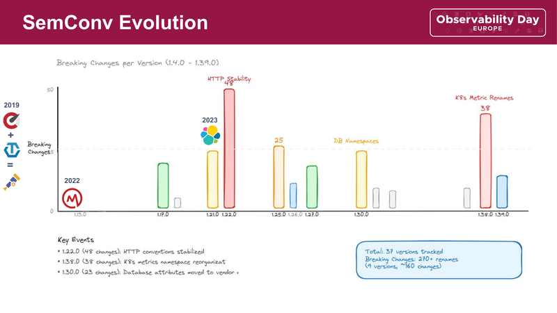
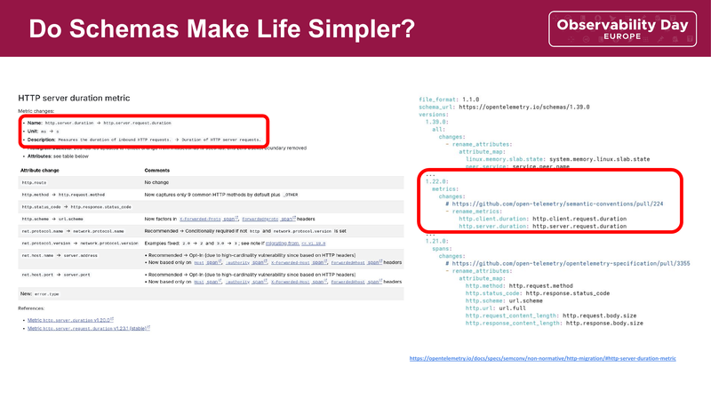
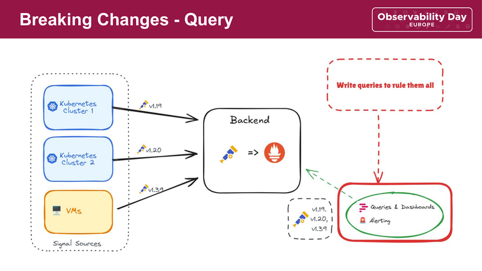
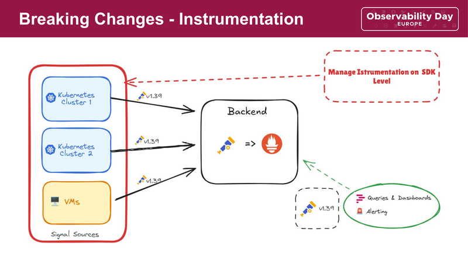
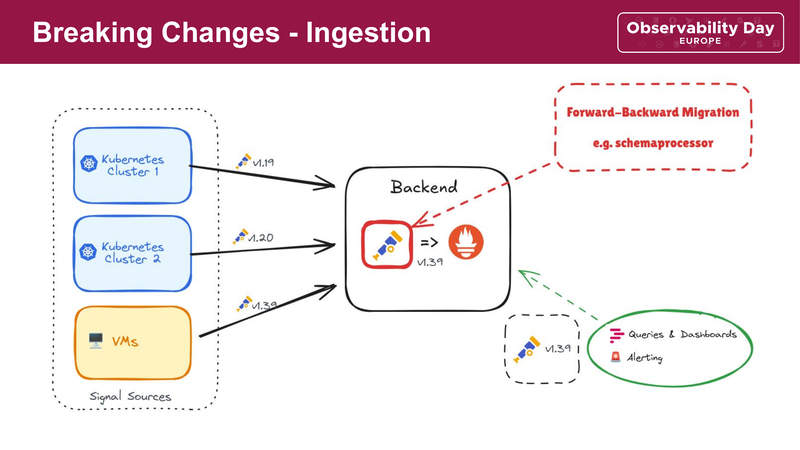
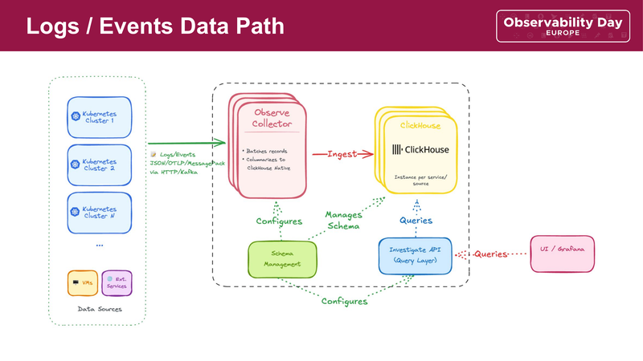
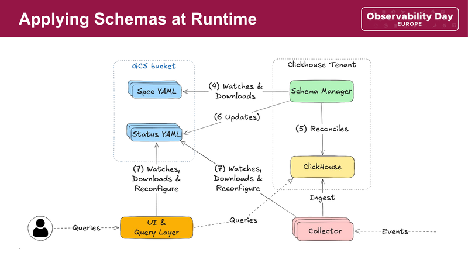

[Sebastian Rabenhorst](https://github.com/rabenhorst) and I had the chance to talk at Observability Day Europe 2026 about a problem that kept coming up in our work: observability schemas change. They change more often than most people expect. This post is a shorter written version of that talk.

## Why should I care about semantics and schemas?

Imagine there are three services in your organisation. Service A emits `http_req_total` with the labels `status` and `endpoint`. Service B calls it `requests_http_total` with `code` and `path`. Service C uses the name `myapp_http_requests_total`, with the labels `response` and `url`.

Although they all measure the same thing, they have three different names. Writing a single dashboard query covering all of them would look like this:



```promql
sum(rate(http_req_total{status="200"}[5m])) +
sum(rate(requests_http_total{code="OK"}[5m])) +
sum(rate(myapp_http_requests_total{response="200"}[5m]))
```

If the three service operators agreed on a common convention, such as `http.server.request.duration` and `http.response.status_code`, it would result in a much simpler single query:



```promql
sum(rate(http_server_request_duration_seconds_count{
    http_response_status_code="200"}[5m]))
```

OpenTelemetry's [Semantic Conventions](https://opentelemetry.io/docs/specs/semconv/) are exactly that. They provide a shared vocabulary, meaning you only need to write queries once for them to work across services and teams.

Sounds great! There's just one catch.

## Semantic conventions keep changing

Observing the OpenTelemetry semantics, there have been around 270 breaking changes between versions 1.4.0 and 1.39.0, followed by approximately 160 attribute and metric name changes.



Some changes to highlight:

- v1.22.0 (48 changes): HTTP conventions stabilized. `http.method` became `http.request.method`, `http.status_code` became `http.response.status_code`.
- v1.30.0 (23 changes): database attributes moved to vendor namespaces.
- v1.38.0 (38 changes): Kubernetes metrics namespace got reorganized.

While most parts of the semantic convention will stabilise over time, there will always be new scopes we have to deal with. Nowadays that means for example semantics for GenAI, which are under development. But even if that does not affect you, it is quite common that your custom instrumentation on your services and products keeps changing over time.

Changes might be renames, using a different base unit, splitting or unifying attributes and so on. To illustrate, we can look at how the HTTP semantics changed in the past: `http.server.duration` became `http.server.request.duration`, pulling along attribute renames and unit changes:



## Mixed versions make it worse

Most organisations do not upgrade all their instrumentation at once. You might start upgrading your software on a small edge cluster first. This makes it even harder to keep track of changed metrics or attributes that no longer match the queries making up your dashboards and alerts. When the majority of your services report HTTP semantics in version 1.19 and only the edge cluster reports 1.39, that mismatch is hard to catch.

## Three places to handle it

Let's look at some different approaches to overcoming that problem. Neither of them might be ideal, but outlining them may help us understand the trade-offs and choose something that fits our setup.

### At query time

By today, handling telemetry from different producers in different versions would require a more complex query like:

```promql
(sum(rate(http_server_request_duration_seconds_sum[5m])))
or
(sum(rate(http_duration_seconds_sum[5m])) / 1000)
```

This handles the semantic renaming and unit change. Unfortunately, that is adding application logic to our dashboards.



One elegant solution might be to make our backend semantics-aware. That way we would not need to write complex queries to cover all semantic versions. Instead, a schema engine could match all telemetry data regardless of the version that produced it.

That said, I would like to highlight the talk by Bartłomiej Płotka and Arianna Vespri, [How To Rename Metrics Without Impacting Somebody's Observability](https://www.youtube.com/watch?v=Rw4c7lmdyFs), which covers exactly this topic based on Prometheus. There is also a related [pull request for versioned OTel semantic convention support](https://github.com/prometheus/prometheus/pull/17702) in Prometheus.

The main tradeoff here would be that each storage backend has to implement this schema translation independently. Another problem is that the current OTel schema does not cover all details that would be required to build a transition schema that could simply be applied.

### At instrumentation time

Technically we could pin all SDKs and auto-instrumentation to a version that ships telemetry with the same semconv version.



But in reality that is somehow unlikely. Dependencies might carry their own instrumentation and get updated with CVE fixes. Sometimes we cannot upgrade dependencies, leaving us stuck with older semantics. Auto-instrumentation can also lead to further complications. For example the OpenTelemetry Operator injects instrumentation using a mutation webhook. After an upgrade, that requires a restart of the entire workload.

Keeping the instrumentation in line requires full control of our, in the best case, super homogeneous environment to work. When maintaining the OpenTelemetry Operator we ran into trouble finding a good time for upgrading the auto-instrumentation carrying breaking changes in [Java past 1.x.x and .NET past 1.2.0](https://github.com/open-telemetry/opentelemetry-operator/issues/2542).

### At ingestion time

One way would be to normalize the incoming telemetry signals using the [schemaprocessor](https://github.com/open-telemetry/opentelemetry-collector-contrib/tree/main/processor/schemaprocessor). It was in development for quite a while, but switched recently to alpha. Especially with schema version 2, it might be a good way forward to migrate. Furthermore, there is also more attention on the collector side to provide a more explicit way of flipping the schema version over to a newer one, tackled in the [Collector RFC for semconv migrations](https://github.com/open-telemetry/opentelemetry-collector/pull/14273).



The idea here becomes clear when we look at the slide. We allow producers to send in telemetry with any semantic version. The collector picks it up and handles the forward migration to a pinned newer version automatically. That way, we only need to maintain dashboards and alerts matching our pinned version. This works similarly to how vendors like [Dash0 offer upgrades of ingested telemetry data](https://www.dash0.com/docs/dash0/miscellaneous/glossary/semantic-convention-upgrades).

There might be an option to downgrade to a specific pinned version, but that is something we should be really careful about. There might come a time where newly captured telemetry can no longer be reflected.

If you own the entire data pipeline end to end, a third option might be to only capture parts of the arriving telemetry data and map it to an internal schema.

## How Shopify does it

Sebastian shared how Shopify internally handles schemas and migrations on their observability platform. Dealing with a large amount of telemetry producers from Kubernetes environments, virtual machines and external services. All sending logs, metrics, traces and profiles into their platform. The platform by that time consists of Thanos for storing metrics, ClickHouse for traces and logs.



Shopify's observability backend accepts telemetry on a push basis, for example from Cloudflare, while internal data is mainly delivered via Kafka. The data itself comes as OTLP, JSON or MessagePack. This data gets batched, normalized and columnarized by their custom Observe Collector and finally written into ClickHouse. The data can be retrieved by requesting it via the Investigate API, an internal proxy for caching and translating to SQL between Grafana and ClickHouse.



The important part here is that all these components have one thing in common: they are configured by the Schema Manager. There is one Schema Manager per tenant, which knows the canonical logical schema, telling the Observe Collector how to transcode and columnarize the data. It manages the physical schema in ClickHouse, like the actual tables, and provides the Investigate API the structure of the tables to perform queries.

The physical schema in ClickHouse is organized by providing specific columns for fields that are regularly retrieved for analytics. Those are referenced here as promoted columns. While all other attributes are organized in typed maps. Note, in reality there are much more promoted columns:

```sql
CREATE TABLE IF NOT EXISTS logging.logs_v0
(
    `timestamp` DateTime64(9),
    -- promoted columns
    `request_id` String,
    `trace_id`   String,
    `component`  String,
    `message`    String,
    -- maps
    `string_attributes` Map(String, String),
    `int_attributes`    Map(String, Int64),
    `float_attributes`  Map(String, Float64),
    `bool_attributes`   Map(String, Bool)
)
ENGINE = MergeTree
PARTITION BY toStartOfHour(timestamp)
ORDER BY (component, toUnixTimestamp(timestamp));
```

The logical schema is the actual semantic mapping on a per-tenant basis. It is defined by providing a name, tenant, and then specific fields we would like to address. The fields are used to map, for example, a JSON path or an OTLP attribute to the physical schema. The kind provides a type for a final conversion:

```yaml
name: logs_v0
tenant: tenant_1
fields:
    - name: http_response_status_code
      paths:
        - http.status_code
        - http.response.status_code
      kind:
          type: int
```

The `paths` list is what makes forward compatibility work. An event with `http.status_code` (old name) or `http.response.status_code` (new name) both map to the same column. The query layer sees one field no matter which version the producer used.

## What we took away from this

Whenever you run an observability platform that accepts telemetry from a handful of clusters, the same principles apply:

1. Define your own canonical naming convention, independent of any upstream version.
2. Version schema changes. Track what changed, when, and why.
3. Support old and new names at the same time during migrations. Set a deadline for the transition.
4. Pick one normalization layer and stick with it. Doing all three creates confusion about who owns what.
5. Test that your dashboards and alerts still work before rolling out schema changes.
6. Measure adoption and remove old mappings once no producer sends the old name.

## What is coming next

With the upcoming OTel schema v2, we may get to the point where we can generate a transition schema between different semconv versions. Allowing Prometheus to implement version-aware queries and the schemaprocessor to migrate data on the fly!

Meanwhile, we should learn about [OpenTelemetry Weaver](https://github.com/open-telemetry/weaver), how it can help us to protect our dashboards and alerts and managing internal schemas! I would like to recommend the talk from Arthur Silva Sens and Nicolas Takashi about [Schema Inference and Automation: A New Era for Telemetry Management](https://kccnceu2026.sched.com/event/2CVzR).

---

The full talk recording is on [YouTube](https://www.youtube.com/watch?v=OSE5gfAjPkE) and the [slides are here (PDF)](slides.pdf). Reach out on [Mastodon](https://mastodon.klimlive.de/@frzifus) if you want to talk about any of this.
